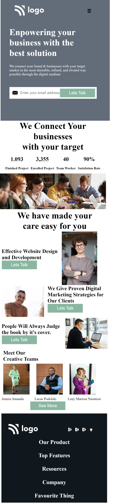

# Hi 👋 I am Devang 
 

## Project Name : **Business Landing Page !**

While learning HTML and CSS I had learned about tables at that point in time it looked pretty useful turns it isn't used at all . I tried to use it in this project purposefully so that i do remember its implementation. This made me realise the importance of grids. 

 

​

# 💻 Tech Stack Used :

​
  

 
​

## 📝 Features

- Responsive for screen size below 600px

- Hosted on Netlify

 

😌 Honest Time to finish the project

     It took me about 10 hrs

 

### You can Check it Live on Below Link :

[Live Link !]()

 

##  Final Output

 

##  Final Output for screen width below 600px

​

